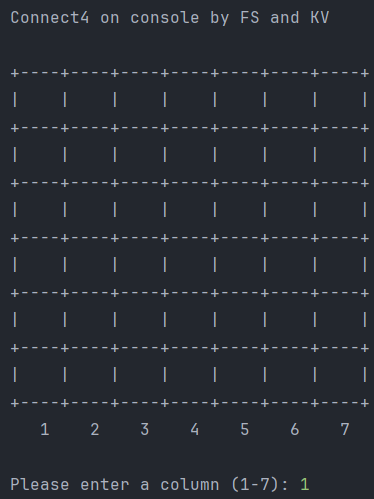
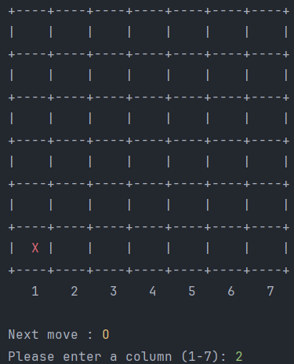
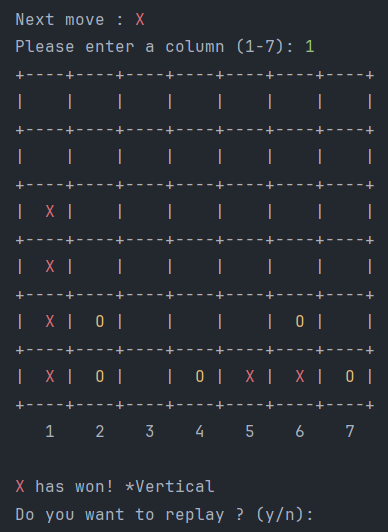
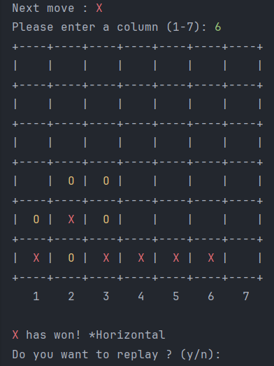
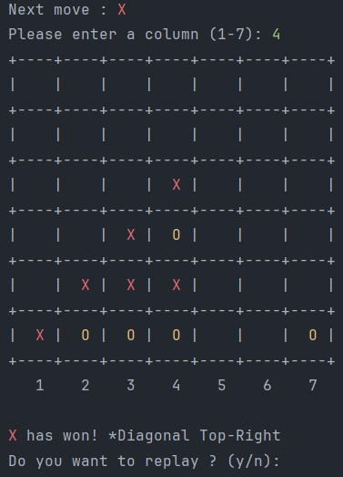
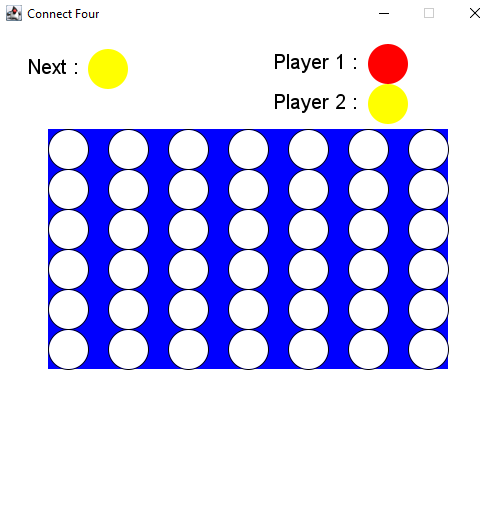
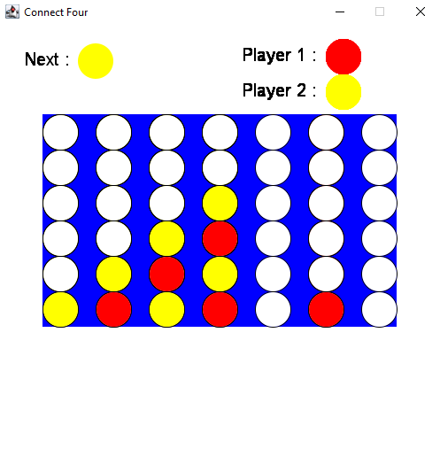
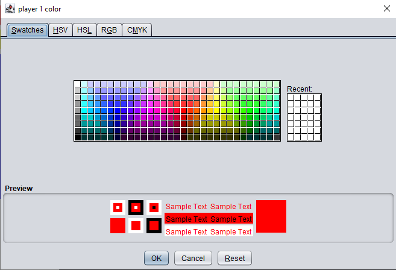

# Connect Four Game - Project Overview

This Scala project implements the Connect Four game with both console and graphical user interfaces. The project is organized into two main packages: `Console` and `WithUi`. Each package contains essential classes that contribute to the functionality of the game.

## Console Package

### Game Class

The `Game` class in the `Console` package is the central component of the console-based Connect Four game. It is responsible for managing player inputs, tracking the game state, and determining the winner. Key functionalities include:

- **Input Management:** Handles player input for selecting columns to place their symbols (X or O) on the grid.

- **Game State:** Manages the state of the game, including the grid, player turns, and move validations.

- **Winning Conditions:** Implements checks for winning conditions, such as getting four symbols in a row horizontally, vertically, or diagonally.

### Grid Class

The `Grid` class in the `Console` package is responsible for displaying and managing the game grid. Key functionalities include:

- **Grid Visualization:** Renders the 7x6 grid using a 2D array in the console.

- **Symbol Display:** Displays the symbols (X or O) of players on the grid.

- **Information Retrieval:** Provides methods to retrieve information about the 2D array, such as column fullness and current symbols.

### Screens of usage

1. The programm will ask the first player to enter a column.

2. Then the console is showing the next move and asks the second player for a column.

3. To win the game, the player has to get 4 of the same Symbol horizontally, vertically or diagonally in both ways
4. Vertical win

4. Horizontal  win

5. Diagonal  win

## WithUi Package

### Game Class

The `Game` class in the `WithUi` package is the main class responsible for managing the graphical user interface (GUI) version of Connect Four. It utilizes FunGraphics for interactive and visual gameplay. Key functionalities include:

- **Interactive GUI:** Manages player interactions through mouse clicks on the graphical grid.

- **Color Selection:** Allows players to choose their preferred colors through rapid mouse clicks.

- **Game State Handling:** Orchestrates the overall game logic, including player turns and win conditions.

### Circle Class

The `Circle` class in the `WithUi` package represents an individual colored circle used in the graphical version of the game. Key functionalities include:

- **Visualization:** Draws and fills circles on the GUI to represent player moves.

- **Color Management:** Handles colors and provides methods for changing and filling circles with specific colors.

### CircleColumn Class

The `CircleColumn` class in the `WithUi` package models a vertical column in the graphical grid. Key functionalities include:

- **Interactive Clicks:** Responds to player clicks within the column and manages the placement of colored circles.

- **Color Change:** Allows for changing the color of circles within the column.

### CustomMouseListener Class

The `CustomMouseListener` class in the `WithUi` package is a custom implementation of the `MouseListener` interface. It is responsible for handling mouse events in the GUI, such as clicks. Key functionalities include:

- **Click Detection:** Identifies single and double clicks to trigger specific actions in the game.

- **Color Change:** Initiates color selection when detecting a double click.

### Screens of usage

1. User interface

2. Diagonal win

3. Double click to change users color

## Package Interaction

- Both packages share the concept of a game (`Game` class) but implement it differently for console and graphical interfaces.

- The `WithUi` package introduces graphical elements (`Circle`, `CircleColumn`, `CustomMouseListener`) to facilitate a visual gaming experience.

- The `Console` package focuses on console-based interactions, relying on the `Grid` class for displaying and managing the game grid.

## Usage

To play the Connect Four game:

1. Run the `Main` object.
2. Choose the game mode: 0 for the graphical interface, 1 for the console game.
3. Follow the on-screen instructions to make moves and enjoy the game.

Feel free to explore and enjoy both console and graphical versions of Connect Four!
