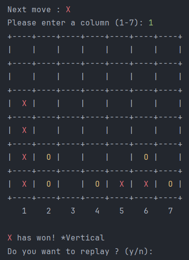

# Connect Four Console Game Project

## Overview

This Scala project implements the Connect Four game with a console user interface.

## Classes and Objects

### 1. Game class

The `Game` class is the main class of the game. It is used to manage the inputs from the players like the column. It contains as well the different checks to find the final Winner!

### 2. Grid Class

The `Grid` class is used to show the 7x6 grid made using 2D Array as well as to show the different symbols of a player (X/O) on the grid. Differents methods are added to get the informations of the 2D Array.

## How to play?

To play the Puissance 4 game:

1. Run the `Main` object.
2. The programm will ask the first player to enter a column.

3. Then the console is showing the next move and asks the second player for a column.

4. To win the game, the player has to get 4 of the same Symbol horizontally, vertically or diagonally in both ways.

5. Vertical win

6. Horizontal win

7. Diagonal win

Enjoy playing this console version of the game!
